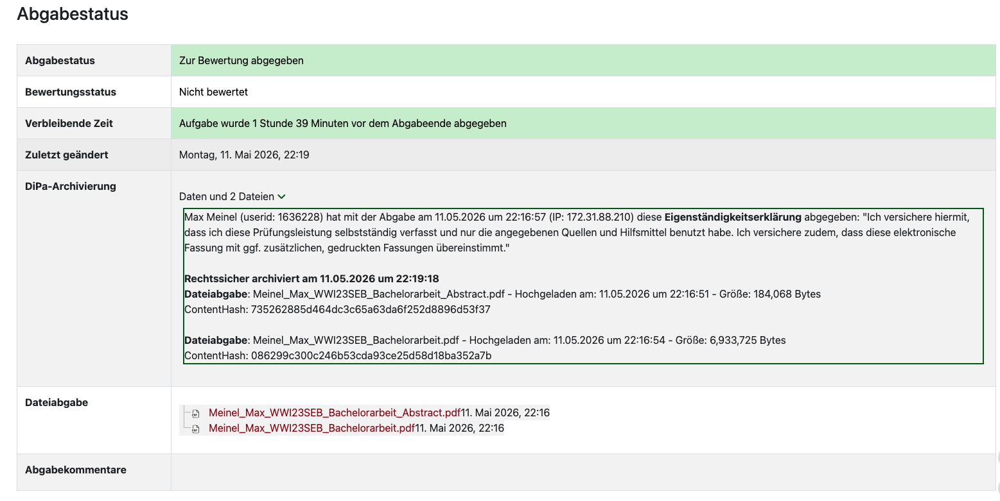

Max Meinel (userid: 1636228) hat mit der Abgabe am 11.05.2026 um 22:16:57 (IP: 172.31.88.210) diese Eigenständigkeitserklärung abgegeben: "Ich versichere hiermit, dass ich diese Prüfungsleistung selbstständig verfasst und nur die angegebenen Quellen und Hilfsmittel benutzt habe. Ich versichere zudem, dass diese elektronische Fassung mit ggf. zusätzlichen, gedruckten Fassungen übereinstimmt."

Rechtssicher archiviert am 11.05.2026 um 22:19:18
Dateiabgabe: Meinel_Max_WWI23SEB_Bachelorarbeit_Abstract.pdf - Hochgeladen am: 11.05.2026 um 22:16:51 - Größe: 184,068 Bytes
ContentHash: 735262885d464dc3c65a63da6f252d8896d53f37

Dateiabgabe: Meinel_Max_WWI23SEB_Bachelorarbeit.pdf - Hochgeladen am: 11.05.2026 um 22:16:54 - Größe: 6,933,725 Bytes
ContentHash: 086299c300c246b53cda93ce25d58d18ba352a7b

